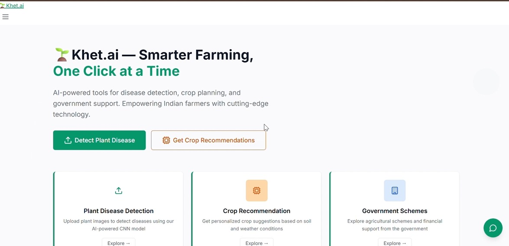

# Khet.ai - AI-Powered Agricultural Platform

## Overview

Khet.ai is a Flask-based agricultural platform designed specifically for Indian farmers. The application provides AI-powered tools for disease detection, crop recommendations, weather insights, and government schemes information.



## Features

- **Plant Disease Detection**: AI-powered image analysis for crop disease identification
- **Crop Recommendation**: ML-based suggestions based on soil and climate data  
- **Weather Insights**: Real-time weather data with agricultural recommendations
- **Government Schemes**: Information about Indian agricultural support programs
- **AI Chatbot**: Bilingual assistant (English/Hindi) for farming guidance

## Technology Stack

- **Backend**: Python Flask
- **Frontend**: HTML5, CSS3, JavaScript
- **Templates**: Jinja2 templating engine
- **APIs**: OpenWeatherMap, Google Gemini AI
- **Design**: Responsive mobile-first design

## Project Structure

```
├── app.py              # Main Flask application
├── templates/          # HTML templates
│   ├── base.html       # Base template
│   ├── index.html      # Home page
│   ├── disease-detection.html
│   ├── crop-recommendation.html
│   ├── government-schemes.html
│   ├── weather-insights.html
│   └── about.html
├── static/             # Static assets
│   ├── css/            # Stylesheets
│   └── js/             # JavaScript files
```


## API Endpoints

- `GET /` - Home page
- `GET /disease-detection` - Disease detection page
- `GET /crop-recommendation` - Crop recommendation page
- `GET /government-schemes` - Government schemes page
- `GET /weather-insights` - Weather insights page
- `GET /about` - About page
- `GET /api/weather?city=<city>` - Weather data API
- `POST /api/disease-detect` - Disease detection API
- `POST /api/crop-recommend` - Crop recommendation API
- `POST /api/chat` - AI chatbot API

## Running the Application

```bash
python run.py
```

The application will be available at `http://localhost:5000`

## Environment Variables

- `OPENWEATHER_API_KEY` - OpenWeatherMap API key for weather data
- `GEMINI_API_KEY` - Google Gemini API key for chatbot functionality

## License

This project is built for educational and agricultural development purposes.
## API Endpoints

- `GET /` - Home page
- `GET /disease-detection` - Disease detection page
- `GET /crop-recommendation` - Crop recommendation page
- `GET /government-schemes` - Government schemes page
- `GET /weather-insights` - Weather insights page
- `GET /about` - About page
- `GET /api/weather?city=<city>` - Weather data API
- `POST /api/disease-detect` - Disease detection API
- `POST /api/crop-recommend` - Crop recommendation API
- `POST /api/chat` - AI chatbot API

## Running the Application

```bash
python app.py
```

The application will be available at `http://localhost:5000`

## Environment Variables

- `OPENWEATHER_API_KEY` - OpenWeatherMap API key for weather data
- `GEMINI_API_KEY` - Google Gemini API key for chatbot functionality

# 🌍 Impact Goals (SDG Focus)
- ✅ SDG 2: Zero Hunger
Helping farmers make informed decisions to boost crop yield and reduce loss.

- ✅ SDG 15: Life on Land
Preventing excessive pesticide usage by early detection and recommendation of best farming practices, ensuring soil and plant health.


## License

This project is built for educational and agricultural development purposes.
